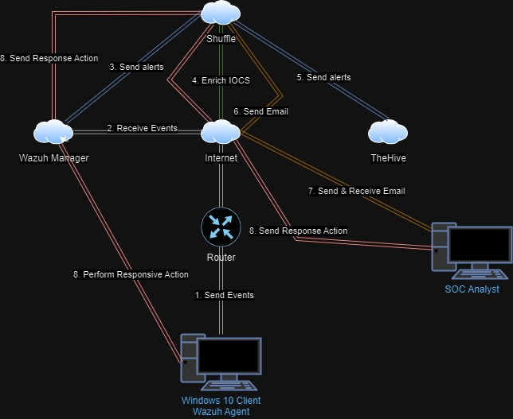
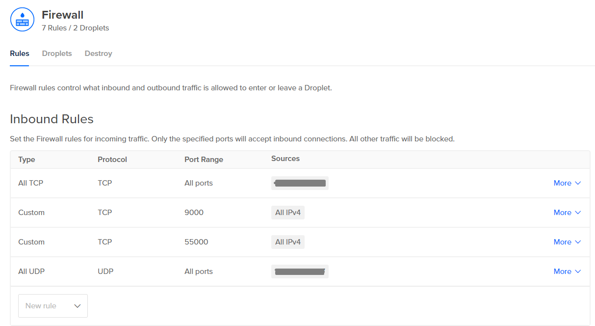

# SOC Automation Project

In this project, I created a Home Lab to simulate a Security Operations Center (SOC) environment in which it will perform automation. The goal of this Home Lab project is to explore how a SOC analyst would investigate alerts and any detections caught in my SIEM. \
\
I have created a diagram that can be found in this project folder describing how my Home Lab will be setup, but here it is as well:

<figure><figcaption></figcaption></figure>

As you can see, I will be using a Windows 10 machine in VirtualBox as my virtual machine and it will represent the Wazuh Agent. Wazuh Management receives events from the Wazuh agent which then sends alerts to Shuffle.&#x20;

Shuffle will use VirusTotal as open source intelligence (OSINT) to enrich the indicators of compromise (IOCs) and send the alerts to our case management, TheHive.&#x20;

Shuffle will then send an email to us (the SOC analyst) with details about the alert and ask the analyst what action(s) need to be taken, if any. The action(s) will be sent back to Shuffle, which will send it to the Wazuh Manager. The Wazuh Manager will instruct the Wazuh agent to perform the action(s).

I will use DigitalOcean cloud provider to store TheHive and Wazuh. I have configured the following firewall settings:&#x20;

<figure><figcaption></figcaption></figure>

<figure><figcaption></figcaption></figure>

The firewall is configured to block all traffic except for my public IP address which I have hidden along with traffic from ports 9000 that is used to connect to TheHive and 55000.

<figure><figcaption>
Shuffle workflow
</figcaption></figure>

This is the workflow on Shuffle that connects everything together. I will have the alert sent to Shuffle, Shuffle will receive the alert and extract the SHA256 Hash from the file. It will then check the reputation score with VirusTotal with the hash. Then, it will send the details to TheHive to create an alert. Finally, it will generate an email to the SOC Analyst to begin the investigation.

To have the received alert in Shuffle checked on VirusTotal in order to enrich the indicators of compromise (IOCs), I need to create a regex that will extract the SHA256 Hash out of the alert.

<figure><figcaption></figcaption></figure>

Specifically, I want to extract the SHA256 hash and parse it into the VirusTotal search to get the reputation score. I will use the following regular expression (regex):

<figure><figcaption>
Regex for SHA256 hash value
</figcaption></figure>

To check that it works, I will launch an attack on my Windows machine that is the Wazuh agent which will then create an alert. I will first download Mimikatz off GitHub using the following link:


Note: it is malicious, do not download unless testing on a VM


<figure><figcaption></figcaption></figure>

I will then deploy it using Windows Powershell on my Windows machine using a VM.

<figure><figcaption>
I renamed Mimikatz to youareawesome.exe to show that it can even detect it with a renamed file
</figcaption></figure>

<figure><figcaption>
Deployed Mimikatz
</figcaption></figure>

I will check if VirusTotal caught the alert with the correct reputation score:

<figure><figcaption></figcaption></figure>

The highlighted malicious attribute shows 61 which matches when I search for Mimikatz with the SHA256 hash value: 61c0810a23580cf492a6ba4f7654566108331e7a4134c968c2d6a05261b2d8a1

<figure><figcaption></figcaption></figure>

Now that it works, I want to setup the SOAR automation so that it sends emails to the SOC Analyst to alert them when it detects malicious executables like Mimikatz.

<figure><figcaption></figcaption></figure>

